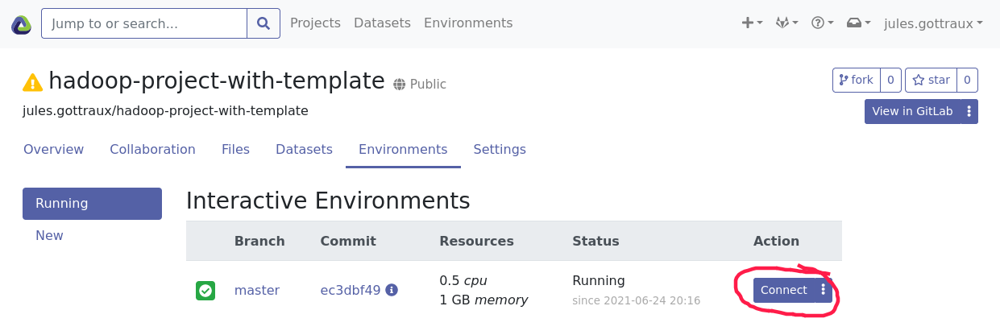

# System Integration of the Hadoop framework in Renku

In this project, we explore how to deploy and configure Data Science projects with Hadoop in . We incorporate the configuration between the two components in our design of template for Renku. This template permits to reduce as much as possible the configuration needed to use a Hadoop cluster. Just from the file that defines the backend (5 to 10 addresses) it can automatize the rest of the procedure while keeping the possibility of configuring further the cluster's components. We also began working on an important configuration element of a Hadoop cluster, namely to provide authentication of the users on the cluster and the services available on it.

# Quick overview of the repository

- [deployments](./deployments): the documentation relative to the Renku and Hadoop deployments
- [hadoop-template](./hadoop-template): our Renku template for Hadoop
- [authentication](./authentication): documentation relative to the setup of authentication on the Hadoop cluster

Along with this project you can find:
- A repository containing an example Hadoop project in Renku that doesn't use our template (current state of Renku): [https://github.com/jjjules/hadoop-project-without-template](https://github.com/jjjules/hadoop-project-without-template)
- A repository containing an example Hadoop project in Renku using our template: [https://github.com/jjjules/hadoop-project-with-template](https://github.com/jjjules/hadoop-project-with-template)

# Motivations

The technology provided by  with its Hadoop framework is the foundation of many leading services when it comes to Big Data processing. With this project, we work on improving the accessibility of this framework by providing documentation for all key components and a proposal of design for integrating an automatic and dynamic configuration of Hadoop in Renku, an open-source platform for reproducible and collaborative Data Science. Developed by the Swiss Data Science Center (), it enables versioning of the code, the data and the environment which together provides full reproducibility of Data Science projects. In the long term by offering a service similar to what we’re designing, Renku would be one of the  rare providers of an easy-to-use Hadoop environment and it would greatly improve the accessibility to it. The Renku plateform is also very useful in academic context. Our work of Hadoop integration in Renku can help the teaching of this framework by providing an easy to use and easy to manage Hadoop template in Renku.

# Background

## Overview of Hadoop

Apache Hadoop is a framework for distributed processing. It is composed of the Hadoop File System (HDFS), YARN and a MapReduce component. HDFS is the distributed file system made for Hadoop. YARN is the job scheduler and cluster resource management, it orchestrates the computation across the nodes and manages the resources needed for the computation. MapReduce is the programming model used by Hadoop, it has been designed for parallel and distributed processing on clusters.

Hadoop serves as the basis for a lot of services for Big Data based on distributed architecture: Spark, Hive, HBase, Kafka, etc. If you are unfamiliar with Hadoop and want to know more, Craig Stedman has made .  It is a very important tool, it is considered as the principal technology for Big Data processing for more than 10 years (), especially in combination with Spark which is widely used.

## Overview of Renku

Renku is a platform for Data Scientists and Analysts, it helps them
create reproducible environments for their project. As Git is for the
code, Renku enables version control for the code, the data and the
computer environment which makes it the perfect tool for collaborative
and reproducible Data Science projects. A Renku project is similar to
any other project, it just needs some additional information for the
creation of the environment, mainly files needed by Docker. Renku is
always linked to a Gitlab instance where Renku stores its projects.

Renku is very intuitive to use. From the web UI of Renku a user can
choose a project and launch an interactive environment with a
command-line interface and the ability to launch jupyter notebooks to
code directly in the browser.

*General structure of Renku using an external computing cluster*

# Hadoop in Renku - Current Situation

There are templates available in Renku to set up a new project rapidly.
A Renku template sets up a simple environment for the needed task. For
example, the template for python will install the packages needed by
python along with additional *nice-to-have* packages, add the extension
manager to jupyter and improve the command-line prompt with powershell.

For a project using Hadoop, the problem is that there is no integrated
support yet. Meaning that to work on a project using Hadoop in Renku,
all the configuration has to be done manually by the user. This includes
installing the softwares for all services, configuring them and
connecting them to their back-end (on the Hadoop cluster). This is
problematic for a number of reasons. First, this is messy as all the
configuration has to be done directly in the Dockerfile of the project.
Hence, there is no separation between the project's code and its setup.
This means that not only all people working on the project have to use
the same back-end but also that a person working with multiple Hadoop
projects has to duplicate the configuration across all of them. This
also comes with a severe security flaw, by sharing the project the user
shares also the resources he or she used in the project. Even if the
cluster is secure, revealing the addresses of the cluster publicly is
never a good idea as it exposes the cluster to attacks (e.g. DDoS).
Secondly, installing and setting up the local machine for Hadoop with
the back-end is not a trivial task. Most of the work will be common to
all projects and thus easily automated. But done by hand this process
takes time and involves a lot of transversal knowledge. In fact, chances
are that without explicit support for Hadoop in Renku, hardly anybody
will take the effort to use Renku with Hadoop. And finally, installing
all the softwares in the Dockerfile will make the creation of the
environment significantly slower than if it was already installed in the
Docker image.

To illustrate this current state in Renku, we've added .

# Hadoop in Renku - Using our template

We show here our template in action. It comes in the form of a Docker image [available here](https://hub.docker.com/repository/docker/renkuhadoop/renkulab-py-hadoop). The only two components required for a working Hadoop project are to use the template and to have the cluster set up in Gitlab as shown below (check the [user guide](./hadoop-template) of the template for more information):

The Dockerfile of the project simply use our Docker image:

Note: at line 6 of the Dockerfile we just give a custom URL for the renku-env so that we can store the backend in a private repository, again check the user guide for more information.

Then we can create an environment and start coding:

