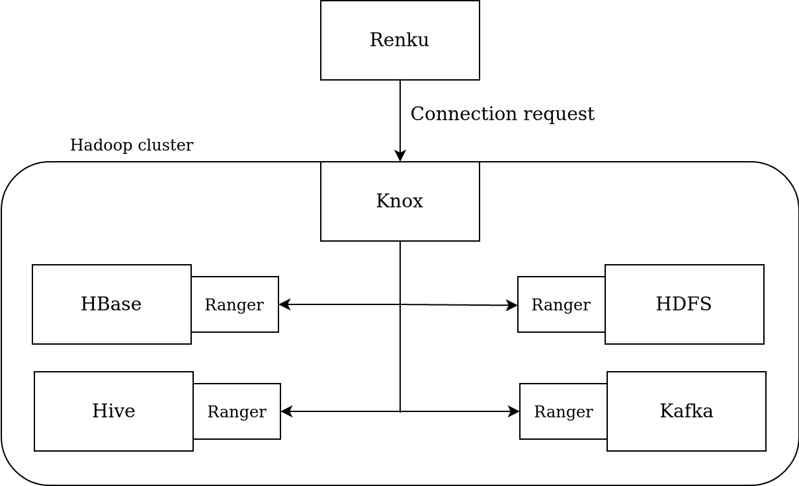

# Authentication to Hadoop services

Our Hadoop deployment does not include any form of authentication, neither to connect to the cluster nor to the services on the cluster.  Not only is this a severe security issue but problems arise also in the management of the cluster because of that. We need the processes to be launched or at least linked in a way to the users, otherwise management becomes much harder. We can't easily kill all processes of a user for example. Moreover, without authentication not only the cluster is unsafe from people without proper access (abuse of resources and attacks) but also are the resources between allowed users. Even unintentionally, one could easily delete resources of other users.

This motivates us to improve our deployment so as to provide both identification of the users to each of their processes and authentication to the cluster and to the services where it is needed. It is important to say that, unlike all other work we present here, part of what we present is still in the designing stage. Meaning that we\'ve not deployed it to our cluster. Hence, we cannot provide complete documentation for these parts but rather explain our approach and show our research about the design.

There are services available in Ambari that can help us for the
authentication, namely [Apache Knox](https://www.cloudera.com/products/open-source/apache-hadoop/apache-knox.html)
and [Apache Ranger](https://www.cloudera.com/products/open-source/apache-hadoop/apache-ranger.html).  Knox is a perimeter security gateway system for the cluster. Meaning that only users successfully authenticated will be given access to the cluster. Additionally, Knox provides a layer of abstraction to the Hadoop services, every service endpoint inside the cluster is accessed via Knox API which already permits identification of users. Ranger is an authorization system handling the access to the cluster resources (HDFS, Hive tables, etc.). Ranger is complementary to Knox, to make a request to Ranger the user has to be authenticated already. The majority of services available in the cluster have Ranger plugins integrated to them allowing easy integration.

We propose to use these two services with [Kerberos](https://stealthbits.com/blog/what-is-kerberos/) as the security protocol. Kerberos has been shown to be very effective and secure and it is the default authorization technology in many domains.  For that, first we have to set up a Key Distribution Center (KDC) on the Hadoop cluster. We did it by following [this tutorial](https://godatadriven.com/blog/kerberos-basics-and-installing-a-kdc/) and as always provide the produced configuration files and additional instructions in [our documentation](https://github.com/jjjules/renku-hadoop/tree/master/authentication/KDC-setup).  Then, Knox and Ranger can be installed directly from the Ambari UI and once installed these services provide their own web UI allowing easy setup and management of users.

That being said, we tried to install Knox several times and with every installation the web UI crashes after a few clicks which makes the setup of the policies painful. As for Ranger, we couldn\'t install the software using Ambari as it depends on Ambari Infra Solr, an indexing service, which fails to install. The reason is that the script used by Ambari expects a repository not present on the MOSGA repositories. To fix this we should make a copy of them and add the needed packages.
