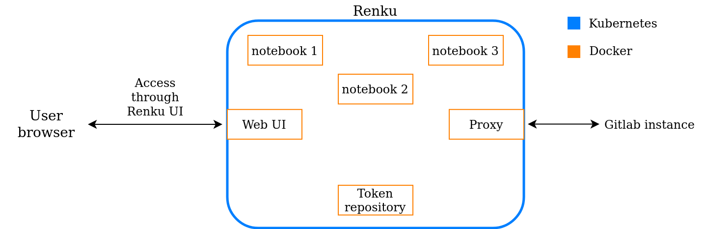

# Renku deployment

## Overview of Renku deployment

A Renku deployment is a collection of Docker containers. Each serves a 
precise role: a server for the web UI, a container running the jupyter 
notebooks, etc. To facilitate the deployment and the management, Renku 
uses [Kubernetes](https://kubernetes.io/docs/concepts/overview/what-is-kubernetes/) 
and [Helm](https://helm.sh/). Kubernetes is a system for automating the 
deployment of Docker containers. It is very useful in this context as 
the deployment is composed of more than a dozen containers plus one 
for each interactive environment running. Kubernetes centralizes the 
management of all containers so that they all are in the same service. 
It also manages the container automatically, restarting a container if 
it crashes for example. Helm is the package manager for Kubernetes. It 
permits the deployment of all containers needed by an application in 
one command. Helm is based on *charts*. A chart contains all the 
information needed by Kubernetes to deploy the application. The only 
$missing component here is the Gitlab instance. As described in the 
introduction, Renku projects are just Git projects with additional 
information. So every Renku deployment is linked to a Gitlab instance 
where Renku stores all of its projects. It\'s up to the administrator 
of Renku to choose between using an existing Gitlab instance (part of 
Renku or not) or creating a new one, but be aware that choosing an 
instance external to Renku [comes with caveats](https://renku.readthedocs.io/en/latest/developer/example-configurations/gitlab.html?#caveats). 
Here we'll keep this part simple and just use the Gitlab instance of 
the public Renku instance: [renkulab.io/gitlab](https://renkulab.io/gitlab/team-renku).



So deploying Renku using Helm is very simple. The first step is to 
choose or deploy a Gitlab instance and then allow Renku to access it.
Then, most of the work is in the creation of the configuration file for Helm. 
It is the only step that can be tricky. It is a YAML file, called `renku-values.yaml`, 
containing all the configuration of your deployment: the address where the UI 
will be accessible, the linked Gitlab instance, the methods of authentication, etc. 
With this file, Renku can be deployed using Renku's Helm chart. Once the deployment 
is successful, it is possible to configure Renku's Gitlab as an identity provider. 
It adds the possibility for the user to login into Renku using a Gitlab account.


We don't go into too much detail here, for more information make sure to read 
[our documentation](https://github.com/jjjules/renku-hadoop/tree/master/deployments/renku) 
where we describe in detail the steps we took for our deployment and 
[the official documentation](https://renku.readthedocs.io/en/latest/admin/index.html) of Renku.

## Precise steps taken for our deployment
We deploy Renku with  as they are more complete:

Configure Kubernetes to use your config file (for example by setting `KUBECONFIG=<PATH_TO_YOUR_CONFIG_FILE>` in your `.profile`).

In your Gitlab instance, under `https://<your-gitlab-url>/profile/applications` , 
create an new application with all scopes checked except for sudo. Save the application 
ID and secret. You’ll need to specify the correct redirection URI for your application. 
Here are ours:

```
https://<deployment-main-url>/auth/realms/Renku/broker/renkulab/endpoint
https://<deployment-main-url>/api/auth/gitlab/token
https://<deployment-main-url>/api/auth/jupyterhub/token
https://<deployment-main-url>/jupyterhub/hub/oauth_callback
```

You need to generate the configuration file for your deployment. This is the `renku-values.yaml` 
file and it can be generated using a basic template and a script that you can download from here. 
Use the application ID and secret you just generated and specify the Gitlab instance you chose 
dand the deployment domain (`https://<deployment-main-url>`).

Add the Renku helm repository with `helm repo add renku https://swissdatasciencecenter.github.io/helm-charts/`

```
Deploy Renku using:
 helm upgrade --install <deployment-name> renku/renku \
 --namespace <your-namespace> \
 -f renku-values.yaml \
 --timeout 1800s
 ```

In another terminal, you should be able to see the pods creating when running 
`kubectl -n <your-namespace> get pods`. If something go wrong during the deployment, 
your `renku-values.yaml` file most likely contain errors and you’ll need to double check 
the redirection URL and the paths in the file manually to debug it.

Once the deployment is successful you should be able to access it under your deployment main URL.

If you want to be able to login to Renku directly using Gitlab (recommended) you’ll need 
to configure you Gitlab instance as and identity provider:

Go to `https://<deployment-main-url>/auth/` and login as admin to the administration console. 
The password is in your `renku-values.yaml` file under global → keycloak -> password → value.

Create a new OpenID Connect v1.0 identity provider.

File the required values. The alias so that the redirect URI match the one you used for 
your Gitlab application, authorization URL to `https://<gitlab-domain>/oauth/authorize`, 
token URL to `https://<gitlab-domain>/oauth/token`. Client ID and secret are again the values generated at step 1.

Verify that it is working by login with your Gitlab account in your Renku deployment.
