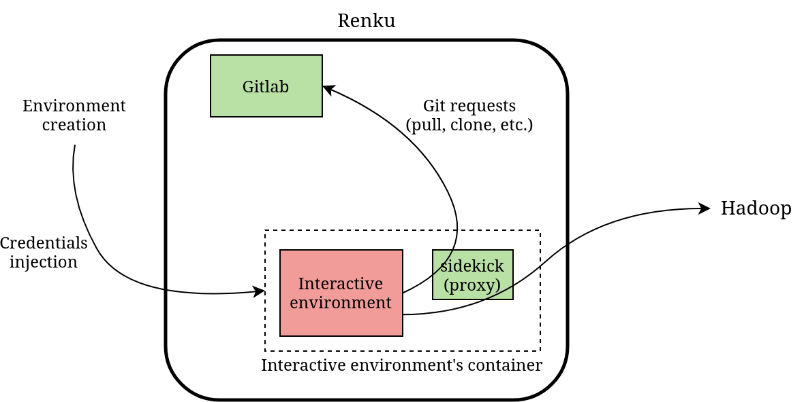

# Hadoop template
## Usage example (TODO: change this into a user guide)
We show here the resulting setup for creating a Renku project using Hadoop using our design on our deployments. We describe the resulting template and how it works. The repository we used for this example can be found ) (TODO: link).

In the project, the only difference between the Hadoop template and a
standard python template is the Docker image used as the entrypoint
script is already present at the root of it. The Docker image handles
all dependencies and static configuration of the machine needed to work
with Hadoop and the entrypoint script handles the dynamic configuration
of the back-end and the linking between the Renku environment and the
back-end. Hence, starting from a standard python Renku project we just
need to change the Docker image for our image for Hadoop. As a side
note, for the purpose of development, to work on the entrypoint script
one can add it at the root of the project and add the following lines
just before the *do not edit* section at of the Dockerfile:

```JSON
# Use custom entrypoint.sh if it exists
USER root
COPY entrypoint.sh /tmp/entrypoint.sh
RUN if [ -f /tmp/entrypoint.sh ]; then mv /entrypoint.sh
/entrypoint.sh.backup; mv /tmp/entrypoint.sh /; fi
USER ${NB_USER}
```

**Code 1 -** Modifying the used entrypoint.sh.

No other modification is needed for the project, but we need a back-end
registered in Gitlab. We will define the back-end in our personal
user-env here, but keep in mind that if this back-end were configured in
a (public) group we belonged to, it would work just the same. For the
first possibility of configuration, we put the backend-conf.json
directly at the root of the renku-env. The content of this file is shown
in **Code 2**. Now that a back-end is present in Gitlab, we can launch
an interactive environment and start to code using the services
available on the cluster. For the sake of example, we show a trivial
code snippet runned in this example project in **Code 6**.

To find the values for the fields in the backend-conf.json file, the
simplest solution is to go to the Ambari dashboard and get the
information from there. The mapping between names in the file and in the
Ambari dashboard is:

-   `HADOOP_DEFAULT_FS_ARG`: fs.defaultFS value in HDFS advanced configuration

-   `HIVE_JDBC_ARG`: get the value hive.llap.zk.sm.connectionString in the advanced configuration of Hive, then the value for `HIVE_JDBC_ARG` is obtained by substituting this value into jdbc:hive2://\<hive.llap.zk.sm.connectionString\>;serviceDiscoveryMode=zooKeeper;zooKeeperNamespace=hiveserver2

-   `HIVE_SERVER_ARG`: _Hive Metastore host_ in the advanced configuration

-   `HBASE_SERVER_ARG`: _Hbase Master host_ in its advanced configuration

-   `YARN_NM_HOSTNAME_ARG`: _NodeManager host_ in YARN's advanced configuration

-   `YARN_RM_HOSTNAME_ARG`: _ResourceManager host_ in YARN's advanced configuration

-   `LIVY_SERVER_ARG`: In Spark configuration summary, under _Livy Server_

Now, if we want to add custom configuration to services on the cluster,
we can do it by providing a configuration repository in the
hadoop-conf.json under the key `BACKEND_MODULES_CONF_REPO` in the
renku-env. We also show this mode of configuration for the choice of the
backend, by providing the backend-conf.json in an external repository,
under the key `BACKEND_CONF_REPO`. The structure of the resulting
hadoop-conf.json is shown in **Code 7**.

```JSON
{
	"BACKEND_CONF_REPO":
		"https://<git-repository-containing-backend-conf.json>",
	"BACKEND_MODULES_CONF_REPO":
		"https://<git-repository-containing-modules-configuration>"
}
```

**Code 7 -** New Hadoop configuration in renku-env (hadoop-conf.json).

As for the example in the design, let\'s just modify the Hadoop username
and the sparkmagic configuration. The modules\' configuration repository
hence contains the files shown in **Code 3** and **Code 4**.

A summary of the methods of configuration is shown in the figure below. One
last note about the results obtained. Our design fully worked on another
deployment but some services (Spark and HBase) failed to work on our own
deployment. The issue seems to be related to the deployment rather than
the design as it worked on the other Renku instance. But for example,
HBase is working when using the shell directly on the cluster on our own
deployment but even with the correct entry point address the Renku
environment fails to connect to it. We either have a connectivity
problem (e.g. misconfiguration in the firewall) or the HBase server is
listening to another port or not listening at all. So there may be
additional configuration needed on the cluster to be able to link the
Renku instance with them as our design does.


## Description of the design
Our design should simplify the creation of Hadoop projects as much as
possible without restricting the possible configurations. A beginner who
has access to some Hadoop cluster should be able to create a project
with the template and use the services without any additional
configuration. But it is necessary to keep the possibility of having
complicated configurations for the more advanced users. We need to
separate completely the choice of the Hadoop cluster and the projects.
Otherwise the issues mentioned previously (security, duplication across
all projects and impossibility to share a project without sharing a
back-end) will persist. Configuring the modules on the cluster should be
optional, as in most cases a standard configuration suffices, but if
needed it should be done in the same way as the choice of the back-end.

The general idea is to have an adapted Docker image already set up to
work with Hadoop and a script running at startup of each environment
that reconfigures the modules if the user has a custom configuration and
completes the configuration by linking the modules to the back-end. To
store the configurations, we use the concept of *renku-env* repository.
In Renku, if you have a repository on Gitlab named renku-env every file
in it will be automatically copied to your home directory at the
environment startup, or appended to the file with the same name if they
already exist. We decide to store the choice of the back-end and the
configuration of the back-end modules in it.

To go into more details, all Renku environments start by creating the
container based on the Docker image and the Dockerfile. The very last
instruction of this process runs a script located at the root of the
container named entrypoint.sh. It is a shell script that takes care of
the dynamic configurations. Originally, it just sets up Git for the
current user, imports the user's renku-env and clones the current
project. For our use case, we use this script to produce the Hadoop
configuration after pulling the renku-env. Our Docker image for Hadoop
can be found .

Concretely, the choice of the back-end is a list of key/value pairs that
will be loaded as environment variables and used by the configuration
files and the services. In our design this is a plain JSON file named
backend-conf.json. This file can either be put directly in the renku-env
or in an external repository. In that case, the repository should be
given in that main Hadoop configuration file of the renku-env, named
hadoop-conf.json. The configuration of the back-end modules cannot be
contained in a file. Rather it is a collection of configuration files
and environment variables. So this has to be in a separated repository.
As for the choice of the backend, the repository should be indicated in
the Hadoop configuration file of the renku-env. We describe the
structure of this repository for the configuration of the modules. In
**Code 1** and **Code 2** we show the structure of the hadoop-conf.json
file and our own backend-conf.json file.

```JSON
{                                                
	"BACKEND_CONF": "<URL-TO-BACKEND-CONF-FILE>",
	"BACKEND_MODULES_CONF_REPO":	"<URL-TO-BACKEND-CONF-REPO-FOR-HADOOP-MODULES>"
}                                                
```

**Code 1 -** Structure of Hadoop main configuration file in renku-env.

```JSON
{
	"HADOOP_DEFAULT_FS_ARG": "hdfs://hadoop-1.datascience.ch:8020",
		"HIVE_JDBC_ARG":
			"jdbc:hive2://hadoop-3.datasci
			ence.ch:2181,hadoop-1.datascience.ch:2181,hadoop-2.datascience.ch:21
			81/;serviceDiscoveryMode=zooKeeper;zooKeeperNamespace=hiveserver2",
		"HIVE_SERVER_ARG": "hadoop-2.datascience.ch",
		"HBASE_SERVER_ARG": "hadoop-1.datascience.ch",
		"YARN_NM_HOSTNAME_ARG": "hadoop-2.datascience.ch",
		"YARN_RM_HOSTNAME_ARG": "hadoop-1.datascience.ch",
		"LIVY_SERVER_ARG": "http://hadoop-1.datascience.ch:8999/"
}
```

Note: The value of `HIVE_JDBC_ARG` will depend of your personal configuration, whether or not you are using ZooKeeper for to discover your services for example.

In our Hadoop deployment we have four nodes, hadoop-1 to hadoop-4 and as
we can see in the backend-conf.json file only the first three appear.
Meaning only the first three nodes contain entry points for services.

In the repository for the configuration of the modules, there is a main
file called backend-modules-conf.json containing the paths where the
configuration file should be put in the Renku environment and
environment variables the user wants to add or change. Adding an entry
for a configuration file is optional for the following files as their
location is already known: ???. These configuration files need
information only available after the container startup, hence the user
can write the names of such variables in the file as placeholder and
these names will be replaced at startup with the appropriate values. The
following variables (along with all new environment variables defined in
`backend-modules-conf.json`) will be replaced in the configuration files:

-   `HDP_HOME`, `HADOOP_HOME` and `HIVE_HOME`

-   `HADOOP_CONF_DIR`, `HADOOP_DEFAULT_FS` and `HADOOP_USER_NAME`

-   `HIVE_JDBC_URL`, `HIVE_SERVER_2`

-   `HBASE_SERVER`

-   `YARN_NM_HOSTNAME`, `YARN_NM_ADDRESS`, `YARN_RM_HOSTNAME`, `YARN_RM_ADDRESS`, `YARN_RM_SCHEDULER` and `YARN_RM_TRACKER`

-   `LIVY_SERVER_URL`

-   `JAVA_HOME`

-   `JUPYTERLAB_DIR`, `JUPYTERLAB_SETTINGS_DIR` and `JUPYTERLAB_WORKSPACES_DIR`

For example, assume a user that wants to change his or her Hadoop
username to other-hadoop-name and change the configuration of sparkmagic
to gain access to more computing power. The repository for the modules'
configuration would have two files in it, backend-modules-conf.json and
sparkmagic.conf, that could look as depicted in **Code 3** and **Code
4**. In **Code 4**, `LIVY_SERVER_URL` is an environment variable that will
be replaced by its value at startup

```JSON
{                                                      
	"CONF_FILES": {                                      
		"sparkmagic.conf": "$HOME/.sparkmagic/config.json"
	},                                                     
	"ENV_VARIABLES": {                                   
		"HADOOP_USER_NAME": "other-hadoop-name"            
	}                                                      
}                                                      
```

**Code 3 -** Example of the main configuration for modules in the
back-end.

```JSON
{
	"kernel_python_credentials" : {
		"url": "LIVY_SERVER_URL"
	},
		"kernel_scala_credentials" : {
			"url": "LIVY_SERVER_URL"
		},
		"custom_headers" : {
			"X-Requested-By": "livy"
		},
		"session_configs" : {
			"driverMemory": "10000M",
			"executorMemory": "42G",
			"executorCores": 16,
			"numExecutors": 32
		},
		"server_extension_default_kernel_name": "pysparkkernel",
		"use_auto_viz": true,
		"coerce_dataframe": true,
		"max_results_sql": 1000,
		"pyspark_dataframe_encoding": "utf-8",
		"heartbeat_refresh_seconds": 5,
		"livy_server_heartbeat_timeout_seconds": 60,
		"heartbeat_retry_seconds": 1
}
```

**Code 4 -** Example configuration for spark magic.

Now there are several flaws to this approach. If the only possibility
for configuring Hadoop is through the user's renku-env, the automatic
detection of a back-end the user has access to is not possible. Ideally,
if a user takes part in a course that gives him or her access to a
cluster, we should have a mechanism to detect this and use the back-end
of the course automatically. This would avoid duplicating the back-end
configuration for all students of that course and in case the back-end
changes the administrator would just have to adapt the configuration of
the course. We can achieve this by using the concept of groups in
Gitlab. A Gitlab group is an entity that englobes a collection of users.
Repositories can be created under a group and so we can have a renku-env
for groups also. Using this, we can have a back-end (choice of back-end
and its configuration) for a group and thus automatically detect the
cluster the user has access to using his or her belonging to Gitlab
groups. At startup the script will look at the available configuration
in the user's groups, override them with the custom configuration of the
user if there is any and load the resulting configuration into the
environment.

This final design fulfills all the objectives we wanted to achieve. A
user belonging to a group with a proper back-end configuration can use
the template without any additional effort. A user can choose his or her
own configuration, re-use another person's configuration for the modules
by just providing the address in the renku-env or make his or her own
configuration. The separation of the project and the back-end eases the
maintenance by avoiding duplication. Maintaining the template will also
require a minimal amount of work as only the Docker image has to be
updated depending on the package\'s releases. It allows users to easily
share a cluster or their cluster configuration. Using it, Renku could
for example give access to clusters as a service easily. All that is
needed would be to put the user in the appropriate Gitlab group.

## Issues and possible improvements:

The interactive environment of Renku is not trusted, so the credentials
for Gitlab are not present inside. Otherwise, a malicious user could
hide scripts running at startup in a project and get full access to the
person's repositories. From that point, the malicious user could delete
all repositories of the user, publish them publicly on the internet or
other undesirable outcomes. For this reason, the communication between
Renku and Gitlab goes through a sidekick that acts as a simple proxy.
Only this sidekick has access to the credentials of the Gitlab account.
What this proxy does is to add the credentials only if the request
(clone, pull, push, etc.) points to the repository from which the Renku
environment has been launched.



**Figure 2 -** Diagram of Renku's communication.

This is problematic for us because we need access to the user's groups
and back-end repositories, whether they are public or private.
Currently, even the renku-env has to be public to be pulled. Moreover,
for obvious security reasons it is important to be able to make the
renku-env private for our design, otherwise we expose our cluster. It is
possible to modify the sidekick so that it gives access to, and only,
the needed Git resources. We only need read-only access to the user's
group names, the renku-env's and the repositories for the back-end. It
makes sense to give access to the user's group names and the renku-env's
but we have to restrict the access for the repositories of the back-end.
For them, we could reserve names, for example renku-hadoop-backend and
renku-hadoop-modules-conf, and only give read access to those. It is
true that if a user creates a repository with the same name, we would
give access to it without him or her knowing but the chance of collision
is very small. We haven't modified the sidekick as just described so in
the current state of the design all used groups and repositories must be
public. The reason is that an active contributor of Renku told us that
storing user settings in Gitlab was "pretty clumsy" and so it will most
likely not be kept in Renku in the long term. The best alternative to
our storing design may be to use a dedicated Renku component. In the
long term, it would also permit access to these configurations directly
in the web UI of Renku. As this storage will most likely change, we
separate the entrypoint script into a `get_configuration.sh` script and a
`load_configuration.sh` script so that in the future only the former needs
to be modified.

To improve the user experience, we tried to add sensible defaults to the
python functions of the different services. For example for Hive, the
user needs to create a Hive connection with hive.connect and give it the
address of the Hive server and a username. We thought it would be
helpful to set the defaults of this function, as well as similar ones
for other services, as we have this information available in the
environment. So that if the user calls hive.connect without any
argument, the function uses the correct Hive address and the username of
the current user. The problem is that there is no support to reassign
defaults of functions in python. The only sensible other alternative
that doesn't involve changing the source code directly would be to
define a new function, e.g. hiveconnector, available in all interactive
contexts that would take care of the defaults if the arguments are
missing. There is the possibility in jupyter to add a python script
running at the startup of each interactive python environment where we
could define this function
().
But there are two main problems with this approach. First, It can
mislead the user into thinking that this function is part of the
codebase of Hive or another package. And more importantly, the code
would not be portable. It wouldn't work anywhere outside of Renku, which
from a reproducibility perspective is not acceptable.

